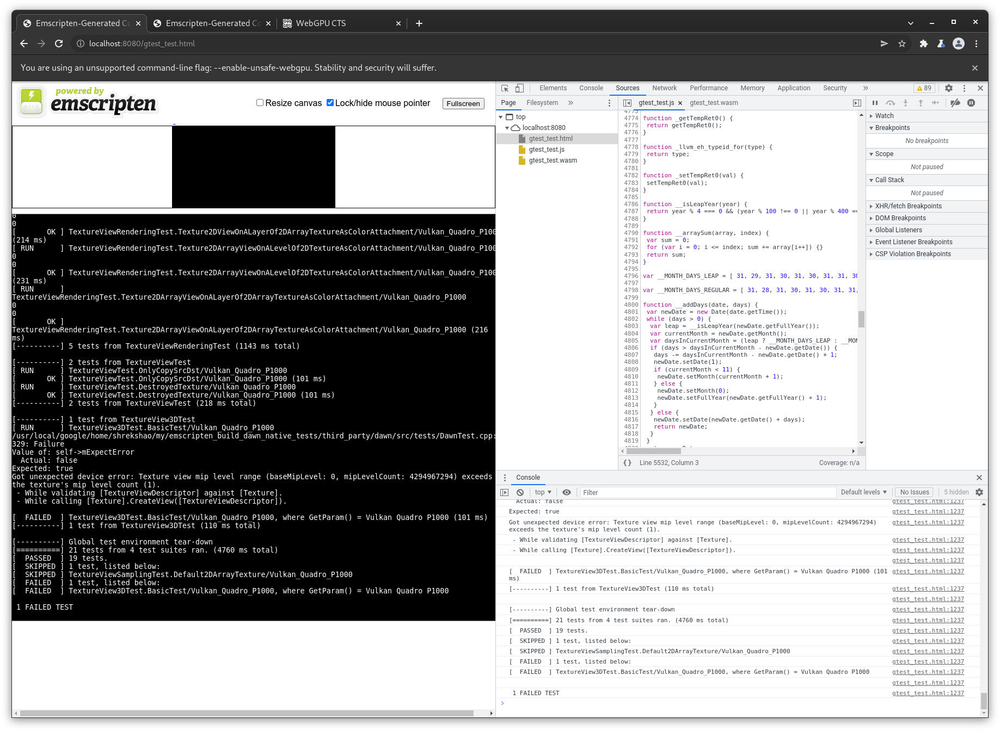
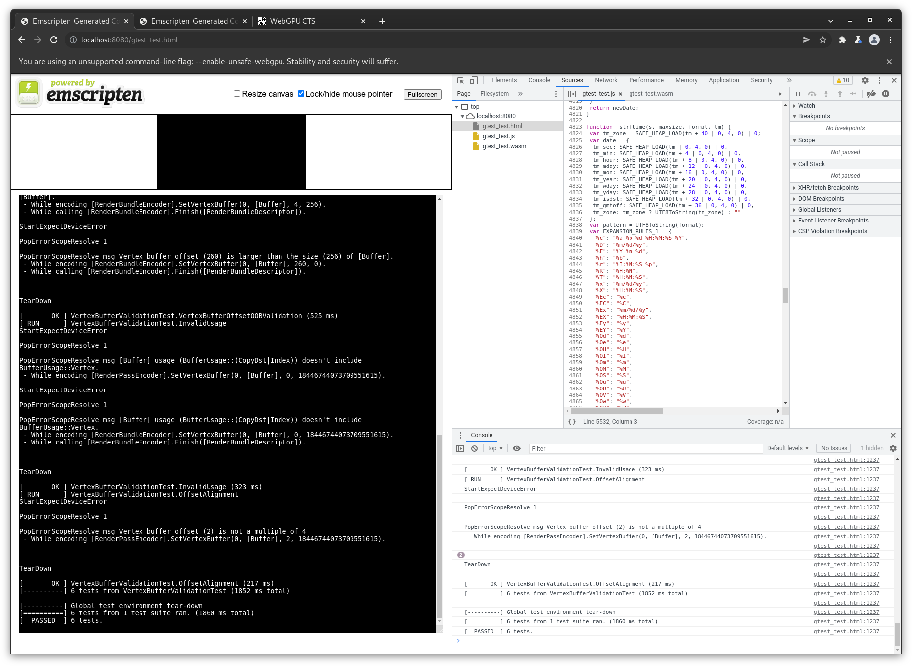

# Emscripten 

# TODO: README

This is **WIP** repo to build dawn end2end and unittests built by emscripten without dawn native source, and run against WebGPU implementations like browsers and dawn_node. So that we can better test emscripten webgpu implementations.





## Building

Instructions are for Linux/Mac; they will need to be adapted to work on Windows (use WSL).

### Web build

This has been mainly tested with Chrome unstable on Linux, but should work on
Chrome/Edge/Firefox on any platform with support.
Requires `chrome://flags/#enable-unsafe-webgpu` on Chrome/Edge.
Requires additional `--enable-features=Vulkan,UseSkiaRenderer` cmd line arg to enable WebGPU on Linux.


**Note:** To build, the active Emscripten version must be at least 3.14 (FetchContent_MakeAvailable).

```sh
# get third_party/dawn source
git submodule update --init --recursive

# Make sure Emscripten tools are in the path. tot install is needed
pushd path/to/emsdk
source emsdk_env.sh
popd

mkdir out
cd out
emcmake cmake ..
make clean gtest_test
```
